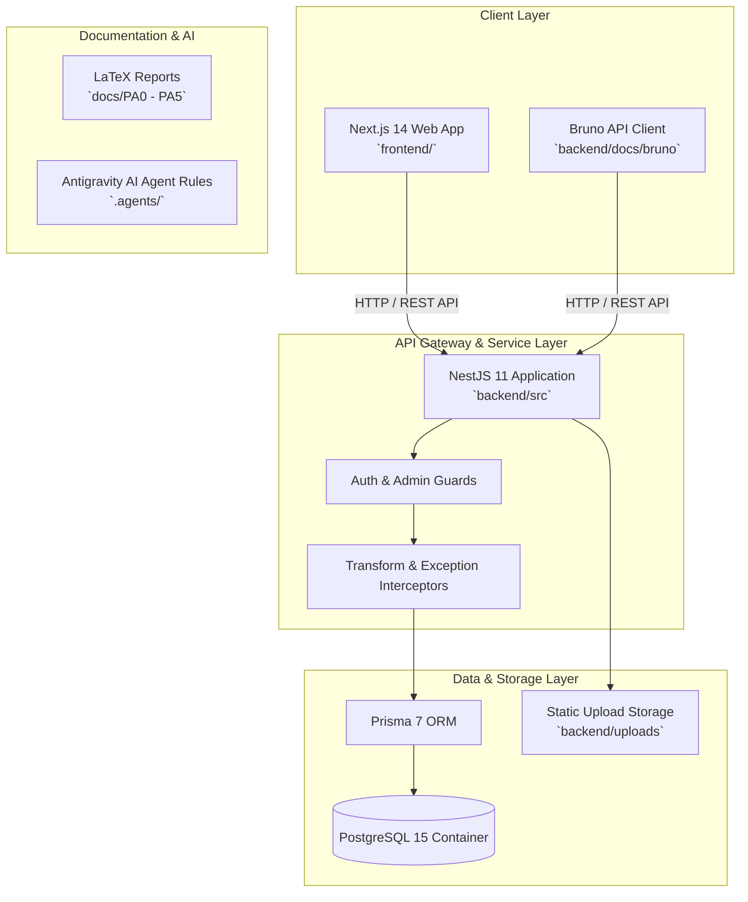

# Mutux - Enterprise Gaming Gear Rental Platform


> **Mutux** is a high-performance P2P and B2C gaming gear rental marketplace and ecosystem designed for gamers, creators, and esports professionals to rent top-tier hardware (GPUs, gaming laptops, VR headsets, mechanical keyboards, monitors, and consoles) with built-in trust, financial escrow, and verification workflows.

---

## Table of Contents

- [Overview and Domain Architecture](#overview-and-domain-architecture)
- [Key Platform Features](#key-platform-features)
- [System Architecture](#system-architecture)
- [Repository Structure](#repository-structure)
- [Prerequisites](#prerequisites)
- [How to Run the Application](#how-to-run-the-application)
  - [Method 1: One-Click Quickstart (Recommended)](#method-1-one-click-quickstart-recommended)
  - [Method 2: Step-by-Step Manual Setup](#method-2-step-by-step-manual-setup)
- [Testing and Verification](#testing-and-verification)
- [API Documentation and Bruno Collections](#api-documentation-and-bruno-collections)
- [Academic and Business Reports (LaTeX Workspace)](#academic-and-business-reports-latex-workspace)
- [AI Agent Ecosystem and Development Rules](#ai-agent-ecosystem-and-development-rules)

---

## Overview and Domain Architecture

High-end gaming equipment is expensive and quickly depreciates. **Mutux** solves this by bridging hardware owners (Lenders) with gamers and creators (Renters) looking for short-term hardware access.

### Core Domain Flow:
1. **User KYC and Onboarding**: All users complete identity verification (KYC) before listing or renting gear.
2. **Gear Listing and Moderation**: Lenders list their equipment with daily/weekly pricing tiers. Admins review and approve listings.
3. **Escrow and Wallet Security**: Renters deposit funds into a virtual wallet or utilize a **Mutux Credit Line**. Funds are locked in **Escrow** upon booking.
4. **Order Lifecycle and Proof Verification**: Handover and return stages require photo/video inspection proofs from both parties to prevent fraud.
5. **Settlement and Dispute Resolution**: On successful return, escrow locks release funds to the Lender's wallet. If damage or loss occurs, Admins use the Dispute Resolution system to adjudicate payouts.

---

## Key Platform Features

- **Gaming Gear Catalog**: Multi-category browsing, search, and date-range availability validation.
- **Stateful Order Lifecycle**: Full state machine (`PENDING_APPROVAL`, `APPROVED`, `ESCROW_LOCKED`, `HANDOVER_PENDING`, `RENTING`, `RETURN_PENDING`, `COMPLETED`, `DISPUTED`, `CANCELLED`).
- **Wallet and Credit Line Ecosystem**: Virtual wallet ledger, top-ups via **mock PayOS** payment gateway, Mutux credit line limits, and payout releases.
- **Escrow Protection**: Automated escrow locks during active rental windows preventing premature fund withdrawals.
- **Inspection Proof System**: Upload and review media proofs for equipment handover and return conditions.
- **Admin and Dispute Management**: KYC approval, gear moderation, dispute adjudication with official resolver identity audit trails.
- **Vanguard Elite UI**: Modern, high-contrast gaming aesthetic built with Next.js 14, Tailwind CSS, and Radix UI components.

---

## System Architecture



---

## Repository Structure

```text
startup-k23-hcmus/
├── backend/                       # NestJS Backend Application
│   ├── docs/                      # Backend Documentation & Bruno Collections
│   │   ├── api.md                 # Complete API Specification Reference
│   │   ├── bruno/                 # Bruno REST API Collection
│   │   └── finance-flow.md        # Wallet & Escrow Financial Design
│   ├── prisma/                    # Prisma Database Schema & Migrations
│   │   ├── migrations/            # SQL Migration History
│   │   └── schema.prisma          # Database Schema & Enums Definition
│   ├── src/                       # Application Source Code
│   │   ├── common/                # Shared Filters, Interceptors, Guards
│   │   └── modules/               # Domain Modules (auth, gears, rental-orders,
│   │                              #  wallets, escrow, disputes, admin, etc.)
│   ├── test/                      # Unit & HTTP Integration Tests
│   └── package.json               # Backend Dependencies & Scripts
│
├── frontend/                      # Next.js Frontend Application
│   ├── design/sketch/             # UI/UX Design Sketches (Vanguard Elite)
│   ├── src/
│   │   ├── app/                   # Next.js App Router Pages
│   │   ├── components/            # Shared UI Components & Radix Primitives
│   │   ├── features/              # Feature-specific Components & Logic
│   │   ├── hooks/                 # React Hooks & State
│   │   └── services/              # API Client & Data Fetching Layer
│   └── package.json               # Frontend Dependencies & Scripts
│
├── docs/                          # Academic & Business Reports
│   ├── PA0/ - PA5/                # Modular Weekly LaTeX Assignment Reports
│   ├── Full Business Plan/        # Comprehensive Startup Business Strategy
│   └── shared/                    # Shared LaTeX Templates & Styles
│
├── .agents/                       # AI Agent Rules & Specialized Skills
│   ├── AGENTS.md                  # Antigravity Agent Guidelines
│   ├── SKILLS.md                  # Domain Skill Directory
│   └── skills/                    # Domain-Specific Skill Guides
│
├── docker-compose.yml             # Docker Infrastructure (PostgreSQL)
├── start.bat                      # 1-Click Automated Startup Script (Windows)
├── start.sh                       # 1-Click Automated Startup Script (Linux/macOS)
└── README.md                      # Platform Master Documentation
```

---

## Prerequisites

Before running Mutux, ensure you have the following installed on your system:

- **Node.js**: `v20.x` or higher (LTS recommended)
- **npm**: `v10.x` or higher
- **Docker and Docker Desktop**: Required for running local PostgreSQL
- **Git**: For version control
- *(Optional)* **VS Code** with **LaTeX Workshop** extension and **MiKTeX / TeX Live** (if compiling LaTeX reports under `docs/`).

---

## How to Run the Application

### Method 1: One-Click Quickstart (Recommended)

Mutux includes automated startup scripts that spin up PostgreSQL in Docker, apply database migrations, install dependencies, and launch both dev servers concurrently.

#### On Windows:
```cmd
start.bat
```

#### On Linux / macOS:
```bash
chmod +x start.sh
./start.sh
```

> **What the script does automatically:**
> 1. Checks Docker installation and status.
> 2. Starts PostgreSQL container via Docker Compose (`mutux-postgres` on port `5432`).
> 3. Waits for PostgreSQL to accept connections.
> 4. Installs backend dependencies (`npm install` in `backend/`).
> 5. Runs Prisma client generation and applies database migrations (`npx prisma migrate deploy`).
> 6. Installs frontend dependencies (`npm install` in `frontend/`).
> 7. Launches NestJS Backend (`http://localhost:8080`) and Next.js Frontend (`http://localhost:3000`).

---

### Method 2: Step-by-Step Manual Setup

If you prefer full control over each component:

#### Step 1: Start PostgreSQL Database
```bash
# From root directory
docker compose up -d postgres
```

#### Step 2: Configure and Start Backend
```bash
cd backend

# Create local environment file
cp .env.example .env

# Install backend dependencies
npm install

# Generate Prisma Client and Run Database Migrations
npx prisma generate
npx prisma migrate deploy

# Seed Database (Optional - Populates mock users, gears, and categories)
npx prisma db seed

# Start NestJS Development Server
npm run start:dev
```
*Backend API will be accessible at:* `http://localhost:8080/api/v1`

#### Step 3: Configure and Start Frontend
Open a new terminal window:
```bash
cd frontend

# Install frontend dependencies
npm install

# Start Next.js Development Server
npm run dev
```
*Frontend Web Application will be accessible at:* `http://localhost:3000`

---

## Testing and Verification

Mutux maintains high quality with unit, integration, and type-check suites.

### Backend Testing Suite
Run from the `backend/` directory:

```bash
cd backend

# Run Unit Tests
npm run test

# Run HTTP / E2E API Tests
npm run test:http

# Run Full Integration Test Suite (PostgreSQL required)
npm run test:integration

# Run Code Linter
npm run lint

# Run Complete Verification Pipeline (Lint + Unit + HTTP + Integration + Build)
npm run test:all
```

### Frontend Testing and Verification
Run from the `frontend/` directory:

```bash
cd frontend

# TypeScript Type Check
npm run typecheck

# Next.js Code Linter
npm run lint

# Validate Production Build
npm run build
```

---

## API Documentation and Bruno Collections

Mutux features a fully documented REST API with strict request/response validation.

- **API Specification Guide**: Located at [`backend/docs/api.md`](file:///D:/HCMUS/Third%20Year/Startup/startup-k23-hcmus/backend/docs/api.md). Details all routes, DTO payloads, authorization roles, and response formats.
- **Bruno REST API Collection**: Located in [`backend/docs/bruno`](file:///D:/HCMUS/Third%20Year/Startup/startup-k23-hcmus/backend/docs/bruno). You can import this folder directly into [Bruno](https://www.usebruno.com/) to execute ready-to-use requests for Auth, Gears, Rental Orders, Wallets, Escrow, and Admin APIs.

### Global API Response Format
All Mutux API endpoints enforce a unified response wrapper:

```json
{
  "success": true,
  "data": { ... },
  "message": "Operation completed successfully",
  "timestamp": "2026-07-29T21:24:41.000Z"
}
```

---

## Academic and Business Reports (LaTeX Workspace)

The repository hosts modular Vietnamese LaTeX reports (`PA0` through `PA5`) for the HCMUS Startup project coursework under the `docs/` folder.

```text
docs/
├── PA0/ - PA5/             # Weekly report modules
│   ├── sections/          # Chapter files (section1.tex, section2.tex, etc.)
│   ├── main.tex           # Primary compiler target
│   └── references.bib     # BibTeX citations
└── shared/
    └── templates/         # Common LaTeX report styles
```

### Compiling Reports via VS Code:
1. Open any chapter file (e.g. `docs/PA0/sections/section1.tex`).
2. Save the file (`Ctrl + S`). LaTeX Workshop automatically compiles `main.tex` and generates a PDF in the respective `PA*` folder.
3. Press `Ctrl + Alt + V` to open the live PDF viewer side-by-side.

---

## AI Agent Ecosystem and Development Rules

Mutux uses an AI-assisted development workflow governed by custom agent guidelines:

- **Agent Rules**: Detailed in [`.agents/AGENTS.md`](file:///D:/HCMUS/Third%20Year/Startup/startup-k23-hcmus/.agents/AGENTS.md).
- **Skill Index**: Indexed in [`.agents/SKILLS.md`](file:///D:/HCMUS/Third%20Year/Startup/startup-k23-hcmus/.agents/SKILLS.md).
- **Core Guidelines**:
  - Code comments must be written in English.
  - API keys must be in `camelCase` and URL paths in `kebab-case`.
  - Frontend visual components follow the **Vanguard Elite** design system (`frontend/design/sketch/Vanguard elite`).
  - Strict preservation of global API response shapes and authentication guards.

---

## License

This project is created for the HCMUS Startup Course (K23). Private and Confidential. All rights reserved.