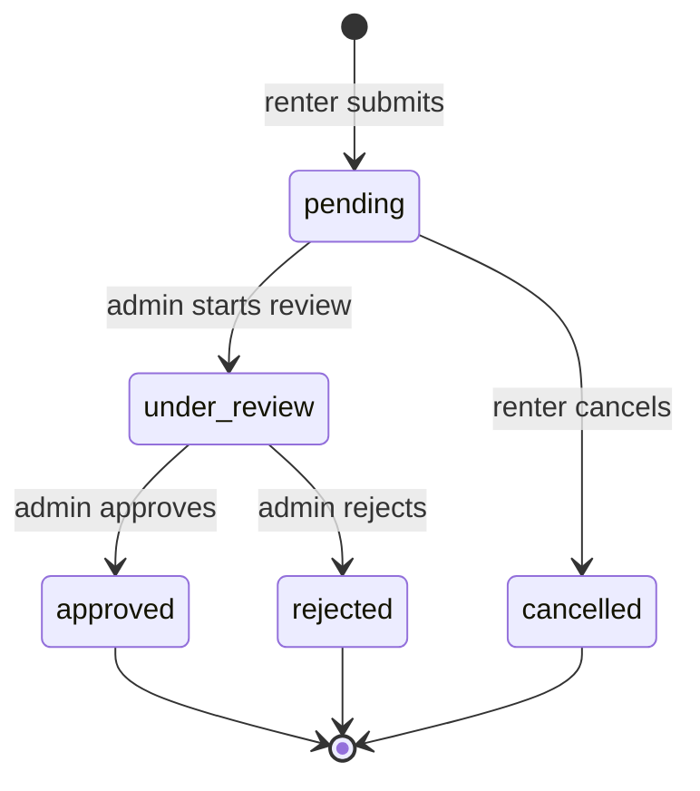

# Mutux – Quy trình cấp và nâng hạn mức tín dụng

> Trạng thái: Đề xuất thiết kế cho MVP  
> Phạm vi: Ví tín dụng của renter (`mutux_wallets`)  
> Cập nhật: 2026-07-31

---

## 1. Mục tiêu

Tài liệu này mô tả use case để renter:

1. Tự động nhận hạn mức cơ bản sau khi KYC được xác minh.
2. Yêu cầu nâng hạn mức đã được cấp.
3. Theo dõi trạng thái xét duyệt.
4. Sử dụng hạn mức làm nguồn bảo đảm tiền cọc cho đơn thuê.

Tài liệu đồng thời quy định cách hệ thống tự cấp tier cơ bản, cách admin xét duyệt
yêu cầu nâng hạn mức, cách cập nhật ví và ledger nguyên tử, cùng các điều kiện bảo
toàn dữ liệu tài chính.

Hạn mức tín dụng trong MVP là hạn mức bảo lãnh nội bộ, không phải tiền thật để renter nạp, rút hoặc chuyển khoản.

---

## 2. Hiện trạng

Schema hiện có model `MutuxWallet` với các trường chính:

```text
total_limit       Tổng hạn mức được cấp
display_balance   Hạn mức còn khả dụng
locked_balance    Hạn mức đang khóa cho các escrow
outstanding_debt  Dư nợ do bồi thường
status            Trạng thái ví
```

Giá trị mặc định ở database:

```text
total_limit       = 0
display_balance   = 0
locked_balance    = 0
outstanding_debt  = 0
```

Backend hiện không tự tạo `mutux_wallets` khi đăng ký renter. Vì vậy renter mới có thể chưa có record ví tín dụng; về nghiệp vụ được xem là chưa được cấp hạn mức và có hạn mức sử dụng bằng `0`.

Hiện chưa có API gửi yêu cầu, xét duyệt hoặc nâng hạn mức. Các hạn mức trong seed data được khai báo trực tiếp.

---

## 3. Thuật ngữ và invariant

### 3.1 Thuật ngữ

- **Hạn mức được cấp** (`total_limit`): mức bảo lãnh tối đa mà renter được phép sử dụng.
- **Hạn mức khả dụng** (`display_balance`): phần hạn mức renter còn có thể khóa cho đơn mới.
- **Hạn mức đang khóa** (`locked_balance`): tổng giá trị các escrow nguồn `credit_line` chưa được giải phóng.
- **Dư nợ** (`outstanding_debt`): nghĩa vụ renter phải hoàn trả sau bồi thường.
- **Yêu cầu hạn mức**: hồ sơ xin nâng hạn mức sau tier cơ bản.

### 3.2 Invariant bắt buộc

```text
display_balance
= total_limit - locked_balance - outstanding_debt
```

Và:

```text
total_limit >= 0
locked_balance >= 0
outstanding_debt >= 0
display_balance >= 0
locked_balance + outstanding_debt <= total_limit
```

Không được cập nhật riêng `display_balance` khi cấp hoặc nâng hạn mức. Hệ thống phải cập nhật `total_limit`, tính lại `display_balance` và ghi ledger trong cùng một database transaction.

---

## 4. Actors

| Actor | Trách nhiệm |
| --- | --- |
| Renter | Gửi yêu cầu, cung cấp thông tin, chấp nhận điều khoản và theo dõi kết quả |
| Admin | Xét duyệt, quyết định hạn mức, ghi lý do phê duyệt hoặc từ chối |
| Credit Partner | Nguồn phê duyệt hạn mức nếu tích hợp đối tác ngoài hệ thống |
| Mutux System | Kiểm tra điều kiện, cập nhật ví, ghi ledger, bảo đảm idempotency và gửi thông báo |

Trong MVP, hệ thống tự cấp hạn mức cơ bản khi KYC được xác minh. Admin chỉ xét duyệt
yêu cầu nâng hạn mức; Credit Partner chưa tham gia xử lý nghiệp vụ.

---

## 5. Chính sách đề xuất cho MVP

### 5.1 Điều kiện tự động cấp hạn mức cơ bản

Renter phải:

- Đăng nhập với role `renter`.
- Có KYC ở trạng thái `verified`.
- Không bị khóa tài khoản.
- Đồng ý điều khoản tín dụng.

Khi KYC chuyển sang `verified`, hệ thống tự động cấp tier cơ bản `3.000.000đ`.
Thao tác này phải idempotent: callback hoặc thao tác verify KYC lặp lại không được
tạo thêm ledger hay cộng hạn mức lần thứ hai.

Điều kiện gửi yêu cầu **nâng** hạn mức:

- Đã có hạn mức cơ bản.
- Không có yêu cầu ở trạng thái `pending` hoặc `under_review`.
- Không có `outstanding_debt > 0`.

### 5.2 Các mức hạn mức tham khảo

| Điều kiện | Hạn mức tối đa đề xuất |
| --- | ---: |
| Chưa KYC | 0đ |
| KYC thành công | 3.000.000đ |
| Hoàn thành ít nhất 3 đơn, không có tranh chấp bất lợi | 5.000.000đ |
| Hoàn thành ít nhất 10 đơn, lịch sử tốt, không có dư nợ | 10.000.000đ |
Không hỗ trợ trường hợp nhập hạn mức tùy ý trong MVP. Các tier là policy cấu hình,
không hard-code trực tiếp trong controller.

### 5.3 Quy tắc xét duyệt

- `requested_limit` và `approved_limit` phải thuộc một trong các tier đang active.
- Admin chỉ được duyệt đúng tier renter đã yêu cầu; nếu muốn duyệt tier khác, admin
  từ chối và renter gửi yêu cầu mới để flow và audit đơn giản.
- Khi nâng hạn mức, `approved_limit` phải lớn hơn `total_limit` hiện tại.
- Không hỗ trợ giảm hạn mức trong MVP.
- Không cho renter tự phê duyệt hoặc tự sửa hạn mức.
- Mọi thay đổi hạn mức phải có actor, thời điểm, lý do và ledger.

---

## 6. Use case UC-CL-01 – Tự động cấp hạn mức cơ bản sau KYC

### 6.1 Tiền điều kiện

- User đã đăng nhập với role `renter`.
- KYC vừa được chuyển sang `verified`.
- User chưa có hạn mức hoặc `total_limit = 0`.
- User đã đồng ý điều khoản tín dụng.

### 6.2 Main flow

1. Admin xác minh KYC của renter.
2. Trong cùng transaction với việc chuyển KYC sang `verified` (hoặc qua một
   idempotent handler được gọi ngay sau đó), hệ thống:
   - Kiểm tra renter chưa từng được cấp hạn mức cơ bản.
   - Tạo hoặc cập nhật `mutux_wallets` với tier `3.000.000đ`.
   - Ghi đúng một `credit_transactions(type = limit_granted)`.
   - Gắn nguồn cấp là `kyc_auto_grant`.
3. Sau commit, hệ thống gửi thông báo cho renter.
4. Trang `/wallet` hiển thị hạn mức khả dụng.
5. Renter có thể chọn `depositType = credit_line` khi thuê gear.

### 6.3 Kết quả

Ví dụ được tự động cấp 3.000.000đ:

```text
total_limit       = 3.000.000
locked_balance    = 0
outstanding_debt  = 0
display_balance   = 3.000.000
status            = active
```

Ledger:

```text
type                   = limit_granted
amount                 = 3.000.000
display_balance_before = 0
display_balance_after  = 3.000.000
direction              = credit
status                 = success
ref_type               = kyc_verification
ref_id                 = kyc_id
```

---

## 7. Use case UC-CL-02 – Yêu cầu nâng hạn mức

### 7.1 Tiền điều kiện

- Renter đã có `MutuxWallet` ở trạng thái `active`.
- Hạn mức yêu cầu lớn hơn `total_limit` hiện tại.
- Không có dư nợ.
- Không có yêu cầu đang xử lý.

### 7.2 Main flow

1. Renter chọn **Yêu cầu nâng hạn mức**.
2. Frontend hiển thị hạn mức hiện tại và các mức có thể yêu cầu.
3. Renter gửi `requestedLimit`.
4. Backend tạo yêu cầu loại `increase`.
5. Admin đánh giá KYC, lịch sử đơn, tranh chấp, trả trễ và dư nợ.
6. Admin phê duyệt hoặc từ chối.
7. Nếu phê duyệt, backend khóa ví và yêu cầu bằng row lock.
8. Backend cập nhật:

   ```text
   total_limit = approved_limit

   display_balance
   = approved_limit - locked_balance - outstanding_debt
   ```

9. Backend ghi `credit_transactions(type = limit_adjustment)`.
10. Backend cập nhật yêu cầu thành `approved` và gửi thông báo.

### 7.3 Ví dụ

Trước khi nâng:

```text
total_limit       = 5.000.000
locked_balance    = 1.000.000
outstanding_debt  =   500.000
display_balance   = 3.500.000
```

Nếu policy cho phép nâng lên 10.000.000đ:

```text
total_limit       = 10.000.000
locked_balance    =  1.000.000
outstanding_debt  =    500.000
display_balance   =  8.500.000
```

Trong MVP đề xuất, trường hợp có `outstanding_debt > 0` phải bị từ chối trước bước xét duyệt. Ví dụ trên chỉ minh họa công thức bảo toàn số dư.

---

## 8. Alternate flows

### 8.1 KYC chưa được xác minh

- Trả `403 KYC_REQUIRED`.
- Không tạo yêu cầu.
- Frontend dẫn renter sang luồng KYC.

### 8.2 Đã có yêu cầu đang xử lý

- Trả `409 CREDIT_LIMIT_REQUEST_PENDING`.
- Không tạo yêu cầu thứ hai.

### 8.3 Có dư nợ

- Trả `422 OUTSTANDING_DEBT_EXISTS`.
- Renter phải hoàn thành luồng thanh toán dư nợ trước.

### 8.4 Admin duyệt thấp hơn mức yêu cầu

- Cho phép nếu `approvedLimit > currentTotalLimit` đối với yêu cầu nâng hạn mức.
- Response và thông báo phải thể hiện cả mức yêu cầu và mức được duyệt.

### 8.5 Admin từ chối

- Yêu cầu chuyển sang `rejected`.
- Bắt buộc có `reviewNote`.
- Ví và ledger không thay đổi.

### 8.6 Gọi approve lặp lại

- Nếu request đã `approved`, trả lại kết quả hiện tại.
- Không cập nhật ví hoặc tạo ledger lần thứ hai.
- Nếu payload approve lặp lại có hạn mức khác, trả `409 APPROVAL_RESULT_MISMATCH`.

### 8.7 Lỗi giữa quá trình cập nhật

Nếu bất kỳ bước cập nhật ví, ledger hoặc request thất bại, toàn bộ transaction phải rollback.

---

## 9. State machine



Transition hợp lệ:

| Từ | Sang | Actor |
| --- | --- | --- |
| `pending` | `under_review` | Admin |
| `pending` | `cancelled` | Chính renter tạo yêu cầu |
| `under_review` | `approved` | Admin |
| `under_review` | `rejected` | Admin |

`approved`, `rejected` và `cancelled` là trạng thái kết thúc.

---

## 10. Data model đề xuất

### 10.1 Enum

```prisma
enum CreditLimitRequestStatus {
  pending
  under_review
  approved
  rejected
  cancelled
}
```

### 10.2 Model

```prisma
model CreditLimitRequest {
  id                String                   @id @default(dbgenerated("gen_random_uuid()")) @db.Uuid
  user_id           String                   @db.Uuid
  requested_limit   Decimal                  @db.Decimal(15, 2)
  current_limit     Decimal                  @db.Decimal(15, 2)
  approved_limit    Decimal?                 @db.Decimal(15, 2)
  status            CreditLimitRequestStatus @default(pending)
  consent_accepted  Boolean
  review_note       String?
  reviewed_by       String?                  @db.Uuid
  reviewed_at       DateTime?
  created_at        DateTime                 @default(now())
  updated_at        DateTime                 @default(now()) @updatedAt

  user     User  @relation("CreditLimitApplicant", fields: [user_id], references: [id], onDelete: Cascade)
  reviewer User? @relation("CreditLimitReviewer", fields: [reviewed_by], references: [id], onDelete: SetNull)

  @@index([user_id, status])
  @@index([status, created_at])
  @@map("credit_limit_requests")
}
```

Nên bổ sung partial unique index bằng SQL migration để mỗi renter chỉ có một yêu cầu đang hoạt động:

```sql
CREATE UNIQUE INDEX uq_credit_limit_request_active
ON credit_limit_requests (user_id)
WHERE status IN ('pending', 'under_review');
```

---

## 11. API contract đề xuất

### 11.1 Renter tạo yêu cầu nâng hạn mức

```http
POST /api/v1/credit-limit-requests
```

Authentication: renter-only.

Request:

```json
{
  "requestedLimit": 5000000,
  "consentAccepted": true
}
```

Success `201`:

```json
{
  "success": true,
  "data": {
    "id": "uuid",
    "requestedLimit": 5000000,
    "currentLimit": 3000000,
    "status": "pending",
    "createdAt": "2026-07-31T08:00:00.000Z"
  }
}
```

### 11.2 Renter xem yêu cầu

```http
GET /api/v1/credit-limit-requests/me
```

Authentication: renter-only.

Trả về yêu cầu hiện tại và lịch sử yêu cầu gần nhất.

### 11.3 Renter hủy yêu cầu

```http
POST /api/v1/credit-limit-requests/:id/cancel
```

Chỉ cho phép chính renter tạo yêu cầu hủy khi trạng thái là `pending`.

### 11.4 Admin xem danh sách

```http
GET /api/v1/admin/credit-limit-requests?status=pending&page=1&limit=20
```

Authentication: admin-only.

### 11.5 Admin bắt đầu xét duyệt

```http
POST /api/v1/admin/credit-limit-requests/:id/review
```

Chuyển `pending` sang `under_review`.

### 11.6 Admin phê duyệt

```http
POST /api/v1/admin/credit-limit-requests/:id/approve
```

Request:

```json
{
  "approvedLimit": 5000000,
  "reviewNote": "KYC hợp lệ, đủ điều kiện hạn mức cơ bản"
}
```

Success `200`:

```json
{
  "success": true,
  "data": {
    "requestId": "uuid",
    "status": "approved",
    "requestedLimit": 5000000,
    "approvedLimit": 5000000,
    "wallet": {
      "totalLimit": 5000000,
      "displayBalance": 5000000,
      "lockedBalance": 0,
      "outstandingDebt": 0,
      "status": "active"
    }
  }
}
```

### 11.7 Admin từ chối

```http
POST /api/v1/admin/credit-limit-requests/:id/reject
```

Request:

```json
{
  "reviewNote": "Chưa đủ lịch sử giao dịch để cấp mức yêu cầu"
}
```

---

## 12. Thuật toán approve nguyên tử

Pseudo-code:

```text
BEGIN TRANSACTION

1. SELECT credit_limit_request FOR UPDATE
2. Nếu approved:
     - cùng kết quả cũ -> trả kết quả hiện tại
     - kết quả khác -> 409 APPROVAL_RESULT_MISMATCH
3. Kiểm tra status = under_review
4. SELECT user và KYC hiện tại
5. SELECT mutux_wallet FOR UPDATE nếu đã tồn tại
6. Kiểm tra outstanding_debt = 0
7. Kiểm tra approved_limit theo policy
8. Tính:
     display_after
     = approved_limit - locked_balance - outstanding_debt
9. UPSERT mutux_wallet:
     total_limit = approved_limit
     display_balance = display_after
     status = active
     approved_at = now
10. INSERT credit_transaction:
      type = limit_granted hoặc limit_adjustment
      amount = approved_limit - previous_total_limit
      display_balance_before = previous_display_balance
      display_balance_after = display_after
      ref_id = request.id
      status = success
11. UPDATE request:
      status = approved
      approved_limit = approved_limit
      reviewed_by = admin.id
      reviewed_at = now
      review_note = input.review_note

COMMIT

12. Gửi notification sau commit
```

Notification không được làm rollback giao dịch tài chính nếu việc gửi thông báo thất bại. Nếu cần độ tin cậy cao, dùng outbox event.

---

## 13. Liên hệ với escrow

Sau khi được cấp hạn mức, renter có thể chọn `credit_line` làm nguồn cọc.

Ví dụ hạn mức 5.000.000đ, cọc đơn thuê 2.000.000đ:

```text
MutuxWallet trước:
total_limit       = 5.000.000
display_balance   = 5.000.000
locked_balance    = 0

MutuxWallet sau:
total_limit       = 5.000.000
display_balance   = 3.000.000
locked_balance    = 2.000.000

EscrowWallet:
amount            = 2.000.000
source            = credit_line
status            = locked
```

Việc khóa hạn mức, tạo escrow và ghi `CreditTransaction(type = deposit_lock)` phải cùng một transaction.

Khi hoàn trả bình thường:

- Escrow chuyển `released`.
- `locked_balance` giảm.
- `display_balance` tăng tương ứng.
- Ghi `deposit_release`.

Khi phát sinh bồi thường:

- Escrow chuyển `compensated`.
- `locked_balance` giảm.
- `outstanding_debt` tăng theo số tiền khấu trừ.
- `display_balance` được tính lại theo invariant.
- Ghi `compensation`.

---

## 14. Error codes

| HTTP | Code | Ý nghĩa |
| ---: | --- | --- |
| 400 | `INVALID_REQUESTED_LIMIT` | Hạn mức yêu cầu không hợp lệ |
| 400 | `INVALID_APPROVED_LIMIT` | Hạn mức duyệt không hợp lệ |
| 401 | `UNAUTHORIZED` | Chưa đăng nhập |
| 403 | `FORBIDDEN` | Sai role |
| 403 | `KYC_REQUIRED` | Chưa hoàn thành KYC |
| 404 | `CREDIT_LIMIT_REQUEST_NOT_FOUND` | Không tìm thấy yêu cầu |
| 409 | `CREDIT_LIMIT_REQUEST_PENDING` | Đã có yêu cầu đang xử lý |
| 409 | `INVALID_REQUEST_STATUS` | Transition trạng thái không hợp lệ |
| 409 | `APPROVAL_RESULT_MISMATCH` | Approve lặp lại với kết quả khác |
| 422 | `OUTSTANDING_DEBT_EXISTS` | Còn dư nợ |
| 422 | `LIMIT_BELOW_COMMITTED_AMOUNT` | Hạn mức mới nhỏ hơn tổng tiền khóa và dư nợ |
| 422 | `CREDIT_POLICY_NOT_MET` | Không đạt chính sách cấp tín dụng |

---

## 15. Authorization và bảo mật

- Endpoint renter phải kiểm tra role `renter`.
- Endpoint xét duyệt phải kiểm tra role `admin`.
- Không tin `userId`, `reviewedBy` hoặc trạng thái gửi từ client.
- Renter chỉ xem và hủy yêu cầu của chính mình.
- Admin không được sửa trực tiếp `display_balance`.
- Các state-changing request phải tuân thủ Origin/CSRF policy hiện tại.
- Ghi audit actor cho mọi approve/reject.
- Không trả thông tin đánh giá nội bộ nhạy cảm nếu policy không cho phép.

---

## 16. Acceptance criteria

### Renter

- Renter chưa KYC thấy `0đ` hoặc trạng thái `not_granted`, không gặp màn hình lỗi `404`.
- Renter được verify KYC tự động nhận hạn mức cơ bản `3.000.000đ`.
- Verify KYC lặp lại không cấp trùng hạn mức và không tạo ledger trùng.
- Renter đã có hạn mức cơ bản có thể tạo yêu cầu nâng lên tier cao hơn.
- Renter không thể tạo hai yêu cầu đang xử lý.
- Renter có dư nợ không thể xin nâng hạn mức.
- Renter không thể gọi API approve/reject.

### Admin

- Admin xem được danh sách pending.
- Admin chỉ có thể approve đúng tier renter yêu cầu.
- Admin bắt buộc nhập lý do khi reject.
- Approve lặp lại cùng kết quả là idempotent.
- Approve lặp lại với hạn mức khác trả conflict.

### Financial consistency

- Approve tạo/cập nhật ví và ledger trong cùng transaction.
- Khi transaction thất bại, request, ví và ledger đều không thay đổi.
- Sau mọi thay đổi:

  ```text
  display_balance
  = total_limit - locked_balance - outstanding_debt
  ```

- Mỗi approve thành công chỉ tạo đúng một ledger entry.
- Không được mất hoặc ghi đè `locked_balance` đang phục vụ escrow.

---

## 17. Test cases tối thiểu

1. Renter chưa KYC -> chưa có Mutux wallet hoặc hạn mức bằng `0`.
2. KYC chuyển sang verified -> tự tạo/cập nhật ví ở tier `3.000.000đ` và ghi một ledger.
3. Verify KYC lần hai -> không đổi ví và không tạo ledger mới.
4. Renter yêu cầu nâng từ 3 triệu lên tier 5 triệu -> `201 pending`.
5. Gửi yêu cầu thứ hai khi đang pending -> `409`, không tạo record mới.
6. Lender/admin gọi endpoint renter -> `403`.
7. Renter gọi endpoint approve -> `403`.
8. Admin approve nâng hạn mức -> giữ nguyên locked/debt, tính lại display balance.
9. Approve cùng payload lần hai -> `200`, không tạo ledger lần hai.
10. Approve khác payload lần hai -> `409`.
11. Reject -> ví và ledger không đổi.
12. Có dư nợ -> không cho nâng hạn mức.
13. Nạp tiền vào ví renter rồi trả đủ nợ -> giảm ví renter và `outstanding_debt`
    trong cùng transaction, đồng thời ghi đủ hai ledger.
14. Số dư ví renter không đủ để trả toàn bộ nợ -> `409`, không thay đổi dữ liệu.
15. Lỗi khi ghi ledger -> toàn bộ thay đổi rollback.
16. Hai admin approve đồng thời -> chỉ một transaction tạo ledger.
17. Hạn mức được cấp có thể dùng để lock escrow.
18. Escrow release trả lại đúng hạn mức khả dụng.

---

## 18. Phạm vi triển khai đề xuất

### Giai đoạn 1 – MVP

- KYC verified tự động cấp tier cơ bản `3.000.000đ`.
- Admin chỉ xét duyệt yêu cầu nâng lên tier `5.000.000đ` hoặc `10.000.000đ`.
- Mức đề xuất: 3 triệu, 5 triệu và 10 triệu.
- Một yêu cầu active trên mỗi renter.
- Chưa tích hợp scoring hoặc Credit Partner thật.
- Notification trong ứng dụng.

### Giai đoạn 2

- Tự động đề xuất hạn mức từ lịch sử thuê.
- Tích hợp Credit Partner.
- Gia hạn và ngày hết hạn hạn mức.
- Cổng thanh toán dư nợ trực tiếp hoặc hỗ trợ trả nợ một phần.
- Giảm hoặc đình chỉ hạn mức có kiểm soát.
- Audit/outbox cho sự kiện tài chính.

---

## 19. Các quyết định đã chốt cho MVP

1. **Tự động cấp 3 triệu sau KYC:** khi KYC chuyển sang `verified`, hệ thống tự
   cấp tier cơ bản `3.000.000đ`; không cần admin duyệt thêm. Việc cấp phải
   idempotent và ghi ledger trong cùng transaction với thay đổi ví.
2. **Tier cố định:** chỉ dùng các tier `3.000.000đ`, `5.000.000đ` và
   `10.000.000đ`. Admin không nhập số bất kỳ và chỉ duyệt đúng tier renter yêu cầu.
3. **Không hủy khi `under_review`:** renter chỉ được hủy lúc `pending`. Khi admin
   đã nhận xử lý, yêu cầu phải đi đến `approved` hoặc `rejected`.
4. **Không có ngày hết hạn:** `expired_at` để `null` trong MVP. Việc hết hạn hoặc
   tái thẩm định định kỳ chuyển sang giai đoạn sau.
5. **Trả nợ qua ví renter:** renter nạp tiền bằng flow top-up hiện có, sau đó gọi
   thao tác trả toàn bộ `outstanding_debt`. MVP chưa hỗ trợ trả một phần và không
   tạo cổng thanh toán nợ riêng. Trừ ví renter, giảm dư nợ và ghi ledger phải nằm
   trong cùng database transaction.
6. **Credit Partner chỉ là metadata:** không có API/callback hay actor đối tác
   thật. `credit_partner_id` và `partner_ref_id` có thể để `null`, hoặc trỏ đến
   một partner demo để phục vụ dữ liệu mẫu.
7. **Chỉ cấp và nâng:** không cho renter/admin chủ động giảm hạn mức trong MVP.
   Admin vẫn có thể khóa toàn bộ ví bằng `status` khi xử lý gian lận; đây không
   phải thao tác giảm `total_limit`.

Quy tắc bổ sung: renter còn bất kỳ `outstanding_debt > 0` nào thì không được gửi
hoặc được duyệt yêu cầu nâng hạn mức.
