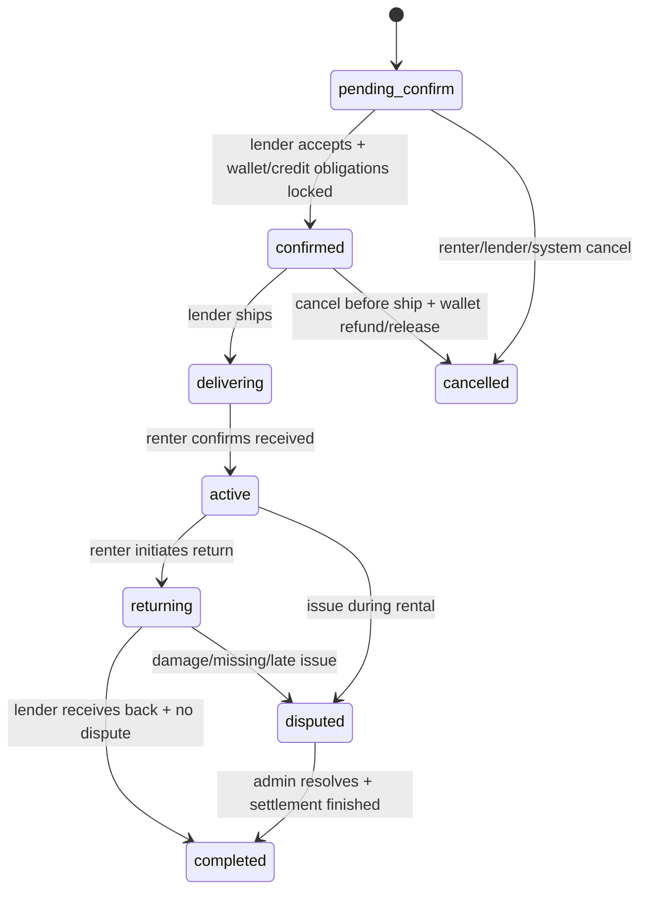

# Mutux – Order Lifecycle & Virtual Wallet Payment Design

> Status: Draft for backend team review  
> Scope of this version: **demo / chạy ảo**, không xử lý tiền thật. PayOS chỉ được mô phỏng ở mức **top-up flow + webhook callback shape** để tăng số dư ví ảo. Sau khi ví đã tăng số dư, toàn bộ cơ chế thanh toán/giữ cọc/settlement chạy bằng ledger nội bộ, tương tự mô hình ví như MoMo.  
> Updated: 2026-06-26

---

## 1. Mục tiêu

Tài liệu này dùng để chốt trước khi code:

1. Vòng đời của đơn thuê (`rental_orders.status`)
2. Luồng **nạp tiền vào ví ảo** theo shape của PayOS
3. Cách webhook callback xác nhận top-up và thay đổi số dư ví ảo
4. Cách renter dùng số dư ví để trả `rental_fee` và `deposit`
5. Quy tắc giữ cọc trong `escrow_wallets`
6. Cách settle doanh thu ảo cho lender qua `lender_wallets`
7. Cách xử lý tranh chấp / trả muộn / hư hỏng

### Kết quả mong muốn

- Team backend có **1 tài liệu single source of truth** để review trước khi implement module `rental-orders`, `payments`, `wallets`, `disputes`
- Tránh tranh cãi lại về semantics của `confirmed`, `active`, `disputed`, `completed`
- Chốt rõ: **không cóเงินจริง trong MVP demo này**
- Chốt rõ: top-up chỉ là **mô phỏng PayOS**, webhook là trigger nội bộ để cộng ví ảo
- Chốt rõ: order payment không charge gateway trực tiếp; order dùng ledger/ví nội bộ

---

## 2. Assumption quan trọng của bản demo

Vì đây **không phải sản phẩm dùng thật**, toàn bộ payment flow được hiểu theo hướng **virtual / simulated only**:

### Điều này có nghĩa là

- Không thu tiền thật từ ngân hàng
- Không cần đối soát thực với sao kê
- Không cần payout thật ra bank account của lender
- Không cần xử lý chargeback thật
- Không cần đảm bảo chuẩn kế toán production-level

### Nhưng vẫn cần giữ đúng “shape” nghiệp vụ

Mục tiêu của flow demo là để:

- test lifecycle của order
- test state transitions
- test escrow logic
- test dispute resolution
- test wallet ledger
- test webhook-driven top-up flow

Nói cách khác:

```text
PayOS ở đây chỉ là shape tích hợp / mock integration,
không phải xử lý tiền thật.
```

---

## 3. Nguồn sự thật hiện có trong repo

### 3.1 Schema và enum

- [backend/prisma/schema.prisma](../prisma/schema.prisma)

Các enum chính đang có sẵn:

- `OrderStatusType`
  - `pending_confirm`
  - `confirmed`
  - `delivering`
  - `active`
  - `returning`
  - `completed`
  - `cancelled`
  - `disputed`
- `DepositTypeEnum`
  - `traditional`
  - `credit_line`
- `EscrowStatusType`
  - `locked`
  - `pending_return`
  - `released`
  - `compensated`
- `PaymentTypeEnum`
  - `rental_fee`
  - `deposit`
  - `credit_fee`
  - `refund`
  - `compensation`
  - `withdrawal`
- `PaymentMethodEnum`
  - `momo`
  - `vnpay`
  - `bank_transfer`
  - `credit_line`
- `PaymentStatusEnum`
  - `pending`
  - `success`
  - `failed`
  - `refunded`
- `DisputeStatusType`
  - `open`
  - `under_review`
  - `resolved`
  - `closed`
- `ResolutionTypeEnum`
  - `refund`
  - `deposit_deduct`
  - `compensation`
  - `account_ban`
  - `no_action`

### 3.2 Tài liệu business/API draft

- [backend/docs/api.md](./api.md)
- [backend/docs/finance-flow.md](./finance-flow.md)
- [backend/docs/schema.md](./schema.md)

### 3.3 Seed data mô phỏng lifecycle

- [backend/prisma/seed.ts](../prisma/seed.ts)

Seed hiện đã có ví dụ cho:

- order `pending_confirm`
- order `delivering`
- order `active`
- order `completed`
- order `cancelled`
- order `disputed`
- escrow `locked`, `released`, `compensated`
- dispute resolved với `deposit_deduct`
- `lender_wallet_transactions` gồm `income`, `compensation`, `withdrawal`

### 3.4 Runtime hiện tại

- [backend/src/app.module.ts](../src/app.module.ts)

Hiện backend runtime **chưa import** các module `rental-orders`, `payments`, `wallets`, `disputes`. Nghĩa là domain đã có trong schema/doc nhưng **chưa được triển khai ở service/controller layer**.

---

## 4. Domain model và vai trò của từng bảng

| Bảng / model | Vai trò chính |
| --- | --- |
| `rental_orders` | Bản ghi trung tâm của đơn thuê |
| `payments` | Ghi nhận top-up/order debit/refund/fee/compensation ở mức nghiệp vụ |
| `escrow_wallets` | Giữ khoản cọc đang lock cho từng order |
| `mutux_wallets` | Ví hạn mức tín dụng (`credit_line`) của renter |
| `credit_transactions` | Audit log biến động hạn mức tín dụng |
| `lender_wallets` | Số dư doanh thu **ảo** của lender |
| `lender_wallet_transactions` | Audit log cộng/trừ số dư lender |
| `rental_proofs` | Bằng chứng ở 4 mốc giao/nhận/trả/nhận lại |
| `disputes` | Bản ghi tranh chấp |
| `notifications` | Thông báo business event cho user |

### 4.1 Schema gap quan trọng: ví ảo của renter

Flow mới cần renter có **ví ảo** để:

- nhận top-up mô phỏng từ PayOS
- trả `rental_fee`
- lock `deposit`
- nhận refund nếu order complete/cancel/dispute resolve

Schema hiện tại có `mutux_wallets`, nhưng bảng này đang mô tả **credit line** chứ không phải ví số dư ảo dùng để chi tiêu.

### Recommendation cho implementation

Nên bổ sung ví riêng cho renter, ví dụ:

```text
renter_wallets
- id
- user_id
- available_balance
- locked_balance
- status
- created_at
- updated_at
```

và ledger:

```text
renter_wallet_transactions
- id
- wallet_id
- rental_order_id nullable
- payment_id nullable
- type: topup | rental_fee | deposit_lock | deposit_release | refund | compensation | adjustment
- direction: in | out
- amount
- balance_before
- balance_after
- ref_type
- ref_id
- note
- created_at
```

> Vì là bản demo, số dư trong `renter_wallets` chỉ là **virtual balance**, không đại diện tiền thật ngoài đời.

---

## 5. Quy ước nghiệp vụ được chốt cho MVP demo

### 5.1 Ý nghĩa của từng status

| Status | Ý nghĩa được chốt |
| --- | --- |
| `pending_confirm` | Order vừa được tạo, lender chưa accept hoặc hệ thống chưa bảo đảm xong nghĩa vụ payment/cọc |
| `confirmed` | Lender đã accept **và** ví/escrow đã bảo đảm đủ nghĩa vụ tài chính |
| `delivering` | Lender đã ship / bàn giao cho đơn vị vận chuyển |
| `active` | Renter đã nhận hàng và thời gian thuê bắt đầu chạy |
| `returning` | Renter đã gửi trả / đang trên đường hoàn trả |
| `disputed` | Order tạm dừng settlement để chờ xử lý tranh chấp |
| `completed` | Order kết thúc, escrow đã release/compensate xong, lender income đã settle |
| `cancelled` | Order bị hủy trước khi hoàn tất vòng đời thuê |

### 5.2 Quy tắc tổng quát

1. PayOS chỉ dùng để **mô phỏng nạp tiền vào ví renter**.
2. Không dùng PayOS để charge trực tiếp `rental_fee`/`deposit` theo từng order.
3. Không dựa vào return URL để cộng ví.
4. Chỉ webhook callback hợp lệ mới được cộng số dư ví demo.
5. Sau khi ví đã có tiền, order payment là **internal wallet debit**.
6. Chỉ khi ví/credit line đã lock đủ nghĩa vụ tài chính thì order mới được vào `confirmed`.
7. `disputed` là trạng thái tạm dừng settlement; order chỉ về `completed` sau khi dispute được resolve.
8. Sau khi order đã vào `active`, không cho hủy kiểu đơn giản; chỉ cho `returning` hoặc `disputed`.

---

## 6. State machine đề xuất cho `rental_orders.status`



### 6.1 Transition table

| Current status | Trigger / actor | Preconditions | DB changes | Money changes | Next status |
| --- | --- | --- | --- | --- | --- |
| `-` | Renter tạo order | Gear hợp lệ, còn khả dụng, date range hợp lệ | Tạo `rental_orders` | Chưa settle | `pending_confirm` |
| `pending_confirm` | Lender accept | Lender đồng ý booking | Ghi nhận accept event/field nếu có | Chưa finalize nếu ví chưa đủ tiền | `pending_confirm` |
| `pending_confirm` | Ví/credit line đủ tiền và lock thành công | Lender đã accept | Tạo internal `payments`, lock escrow/cọc | Debit ví cho rental fee, lock cọc | `confirmed` |
| `pending_confirm` | Renter/Lender/System cancel | Chưa ship | Mark cancelled | Release lock nếu đã có | `cancelled` |
| `confirmed` | Lender ship | Order đã đảm bảo tài chính | Set `lender_shipped_at`, proof `pre_shipment` | Không đổi | `delivering` |
| `confirmed` | Cancel before ship | Theo policy cho phép | Mark cancelled | Hoàn rental fee về ví + release deposit/credit lock | `cancelled` |
| `delivering` | Renter xác nhận nhận hàng | Có giao hàng thành công | Set `renter_received_at`, proof `post_received` | Không đổi | `active` |
| `active` | Renter gửi trả | Chuẩn bị kết thúc thuê | Set `renter_returned_at`, proof `pre_return` | Chưa release escrow | `returning` |
| `active` | Renter/Lender mở dispute | Có vấn đề trong lúc thuê | Tạo `disputes` | Tạm dừng settlement | `disputed` |
| `returning` | Lender xác nhận nhận lại, hàng OK | Không có dispute | Set `lender_received_back_at`, proof `post_returned` | Release escrow + settle lender income | `completed` |
| `returning` | Lender mở dispute | Có hư hỏng/mất phụ kiện/trả muộn | Tạo `disputes` | Tạm dừng settlement | `disputed` |
| `disputed` | Admin resolve | Có quyết định cuối cùng | Update `disputes`, escrow, wallet tx | Refund/release/compensate theo resolution | `completed` |

### 6.2 Khi nào order được coi là `confirmed`?

Order chỉ được coi là `confirmed` khi thỏa **đồng thời**:

1. Lender đã accept booking
2. `rental_fee` đã được debit thành công từ ví ảo của renter
3. `deposit` đã được bảo đảm theo một trong hai cách:
   - `traditional`: số dư ví renter bị lock vào escrow
   - `credit_line`: hạn mức tín dụng bị lock vào escrow

> Nếu lender đã accept nhưng ví renter chưa đủ tiền, order vẫn ở `pending_confirm` và frontend cần yêu cầu renter top-up ví thêm.

---

## 7. Top-up ví ảo theo shape của PayOS

## 7.1 Tư duy tổng quát

PayOS trong bản demo chỉ nằm ở lớp **cash-in simulation**:

```text
Mock checkout / simulated PayOS flow
        ↓ webhook callback verified
Renter virtual wallet balance increases
        ↓ internal ledger
Order rental fee / deposit / escrow / refund / compensation
```

PayOS không trực tiếp quyết định order `confirmed` hay `completed`. Nó chỉ đóng vai trò **mô phỏng một gateway top-up**.

## 7.2 Create top-up checkout

Endpoint đề xuất:

```http
POST /wallets/topups/checkout
```

Body ví dụ:

```json
{
  "amount": 500000,
  "method": "payos"
}
```

Luồng demo:

1. Renter yêu cầu nạp tiền vào ví.
2. Backend validate amount.
3. Backend tạo một top-up record ở trạng thái `pending`.
4. Backend trả về `checkoutUrl` mô phỏng hoặc `mockCheckoutId`.
5. Frontend redirect sang trang giả lập / màn test.
6. Từ flow test, hệ thống gọi webhook callback để mark top-up thành công.

> Vì là demo, bước 4-6 có thể làm bằng local page, Bruno request, hoặc nút “Simulate success webhook”. Không cần gọi gateway thật.

### Ghi nhận dữ liệu tối thiểu

Nếu chưa thêm bảng mới, có thể tạm dùng `payments` với `rental_order_id = null`.

Khuyến nghị sạch hơn:

```text
wallet_topups
- id
- user_id
- amount
- method
- status
- gateway
- gateway_order_code
- gateway_payment_link_id
- gateway_reference
- created_at
- paid_at
```

### Recommendation enum

Nếu đi theo schema hiện tại, nên thêm:

```text
PaymentTypeEnum.topup
PaymentMethodEnum.payos
```

---

## 8. Webhook callback dùng để cộng ví ảo

## 8.1 Webhook là source of truth của top-up demo

- Return URL chỉ phục vụ UX.
- Chỉ webhook callback hợp lệ mới được cập nhật số dư ví.
- Không được cộng tiền vào ví từ query params trên browser.

## 8.2 Webhook flow

1. Hệ thống nhận callback mô phỏng PayOS.
2. Backend verify signature hoặc verify mock token/rule tương đương.
3. Backend kiểm tra idempotency theo:
   - `paymentLinkId`
   - `orderCode`
   - `reference`
4. Backend tìm top-up pending tương ứng.
5. Backend kiểm tra amount khớp.
6. Backend update top-up/payment `success`.
7. Backend cộng `available_balance` ví renter.
8. Backend ghi ledger `renter_wallet_transactions.type = topup`, `direction = in`.
9. Backend notify frontend/user nếu cần.

## 8.3 Idempotency rule

Webhook lặp lại phải no-op nếu top-up đã `success`.

Không được xảy ra case:

```text
1 webhook thành công -> cộng ví 2 lần
```

Pseudo-rule:

```text
if topup.status == success:
    return 2xx without changing balance
else:
    verify amount
    mark success
    increase wallet balance
    create wallet ledger
```

## 8.4 Return URL

Return URL chỉ dùng để frontend hiển thị:

- `PAID`
- `PENDING`
- `PROCESSING`
- `CANCELLED`

Frontend nên gọi API nội bộ để lấy số dư ví và order status mới nhất sau khi user quay về.

---

## 9. Dòng tiền order sau khi ví đã có số dư

## 9.1 Case A — Traditional deposit, happy path

### Luồng

1. Renter top-up ví ảo thành công.
2. Ví renter tăng số dư.
3. Renter tạo order với `deposit_type = traditional`.
4. Lender accept.
5. Backend kiểm tra ví renter đủ:
   - `rental_fee`
   - `deposit_amount`
6. Backend debit `rental_fee` từ ví renter.
7. Backend lock `deposit_amount` từ ví renter vào escrow.
8. Order -> `confirmed`.
9. Order hoàn thành bình thường.
10. Backend release deposit về ví renter.
11. Backend settle doanh thu ảo sang `lender_wallets`.

### Ledger đề xuất

Ví renter:

```text
topup:         + amount mô phỏng
rental_fee:    - rental_fee
deposit_lock:  - deposit_amount
refund:        + deposit_amount khi completed
```

Escrow:

```text
escrow_wallets.source = renter_cash
escrow_wallets.status = locked -> released
```

Lender wallet:

```text
lender_wallet_transactions.type = income
lender_wallets.balance += rental_fee_after_platform_fee
```

---

## 9.2 Case B — Credit line deposit, happy path

### Luồng

1. Renter top-up ví ảo nếu cần để trả `rental_fee`.
2. Ví renter tăng số dư.
3. Renter tạo order với `deposit_type = credit_line`.
4. Lender accept.
5. Backend debit `rental_fee` từ ví renter.
6. Backend lock `deposit_amount` từ `mutux_wallets` credit line.
7. Tạo `escrow_wallets.source = credit_line`.
8. Order -> `confirmed`.
9. Khi order completed bình thường:
   - release credit line lock
   - settle doanh thu ảo cho lender

### Ledger đề xuất

Ví renter:

```text
topup:      + amount mô phỏng
rental_fee: - rental_fee
```

Credit line:

```text
mutux_wallets.display_balance -= deposit_amount
mutux_wallets.locked_balance  += deposit_amount
credit_transactions.type = deposit_lock
```

Completion:

```text
mutux_wallets.display_balance += deposit_amount
mutux_wallets.locked_balance  -= deposit_amount
credit_transactions.type = deposit_release
```

> Chốt rule: `credit_line` chỉ dùng để bảo đảm cọc. `rental_fee` vẫn được trả từ ví renter.

---

## 9.3 Case C — Damage / dispute with partial deduction

### Ví dụ

- `deposit_amount = 2.000.000`
- `deduct_amount = 500.000`

### Traditional deposit

- Escrow đang giữ số dư ví renter đã lock.
- `500.000` chuyển sang lender như `compensation`.
- `1.500.000` release về ví renter.
- Escrow đổi sang `compensated`.

### Credit line

- Phần `500.000` trở thành phần bảo lãnh bị sử dụng.
- `locked_balance` giảm.
- `outstanding_debt` tăng tương ứng phần bị khấu trừ.
- Phần còn lại được mở khóa về `display_balance`.
- Lender nhận `compensation`.

---

## 9.4 Case D — Late return

### Rule đề xuất cho MVP

- Late fee được coi là một dạng `compensation`/`penalty`.
- Ưu tiên trừ từ escrow trước.
- Nếu escrow không đủ:
  - phần còn lại trở thành nghĩa vụ ảo phải thu bổ sung
  - chưa bắt buộc xử lý trong v1 demo

### Công thức business tạm chốt

```text
late_fee = snapped_rent_price_per_day * số_ngày_trễ
```

### Settlement thứ tự ưu tiên

1. Trừ late fee từ escrow.
2. Nếu còn tranh chấp khác, resolve chung trong dispute.
3. Nếu escrow vẫn dư, release phần còn lại về ví renter hoặc credit line.
4. Nếu escrow thiếu, ghi nhận outstanding receivable cho phase sau.

---

## 9.5 Case E — Cancelled order

### Trường hợp 1: chưa lock tiền order

- `rental_orders.status = cancelled`
- Không có settlement

### Trường hợp 2: đã lock/debit nhưng chưa ship

- Hoàn `rental_fee` về ví renter
- Release deposit về ví renter hoặc credit line
- Escrow `released`
- Order `cancelled`

### Trường hợp 3: top-up pending nhưng order bị cancel

- Không ảnh hưởng order nếu top-up success về sau
- Callback vẫn cộng tiền vào ví renter vì top-up là giao dịch ví độc lập, không phải order payment trực tiếp

### Trường hợp 4: đã ship rồi

- Không cho cancel kiểu đơn giản
- Chuyển sang xử lý `returning` hoặc `disputed`

---

## 10. Mapping vào schema hiện tại

## 10.1 Mapping tối thiểu cho top-up demo

| Khái niệm | Mapping hiện tại / đề xuất |
| --- | --- |
| Người nạp tiền | `users` |
| Top-up intent | `payments` với `rental_order_id = null` hoặc bảng `wallet_topups` mới |
| Gateway mô phỏng | `payos` |
| Gateway payment link | `paymentLinkId` |
| Gateway transaction ref | `reference` |
| Số dư ví renter | cần thêm `renter_wallets` hoặc equivalent |
| Ledger ví renter | cần thêm `renter_wallet_transactions` hoặc equivalent |
| Kết quả top-up | `pending` -> `success` / `failed` |

## 10.2 Gaps cần xử lý trước khi code

### Gap 1 — Chưa có `PaymentMethodEnum.payos`

Nên thêm nếu vẫn muốn bám sát shape PayOS.

### Gap 2 — Chưa có `PaymentTypeEnum.topup`

Nên thêm nếu dùng chung bảng `payments` để log top-up.

### Gap 3 — Chưa có ví renter riêng

Cần thêm `renter_wallets`/`cash_wallets` và ledger tương ứng nếu muốn cơ chế ví ảo giống MoMo.

### Gap 4 — `orderCode` mô phỏng

Nếu giữ shape PayOS, nên dùng **mã top-up riêng** dạng số hoặc dạng deterministic cho top-up, không dùng `rental_orders.order_code`.

### Gap 5 — Thiếu raw webhook audit

Nên cân nhắc log raw callback để debug reconciliation, dù chỉ là demo:

```text
payment_webhook_logs
- id
- provider
- event_ref
- payload
- signature_valid
- processed_at
- processing_status
```

---

## 11. Service design note

### 11.1 Provider abstraction

Mức design, chưa phải code cụ thể:

```ts
createTopupCheckout(user, amount)
verifyReturnCallback(payload)
verifyWebhook(payload)
normalizeTopupStatus(payload)
extractGatewayRefs(payload)
```

### 11.2 Tách 3 lớp rõ ràng

#### Lớp 1 — Gateway cash-in simulation

- tạo mock checkout
- nhận callback kiểu PayOS
- verify signature/token mock
- cộng ví renter

#### Lớp 2 — Internal wallet ledger

- debit ví cho rental fee
- lock ví cho deposit
- release/refund
- audit balance before/after

#### Lớp 3 — Order state transition

- check obligations
- move order status
- trigger notifications
- settle lender wallet

---

## 12. Mapping event -> field update

| Event | Field/table cần cập nhật |
| --- | --- |
| Renter tạo top-up | `wallet_topups` hoặc `payments(type=topup).status = pending` |
| Callback success | top-up `success`, renter wallet balance tăng |
| Renter tạo order | `rental_orders.status = pending_confirm` |
| Lender accept | ghi nhận accept event/field nếu có |
| Debit rental fee từ ví | wallet ledger `rental_fee`, `payments(type=rental_fee).status = success` |
| Lock deposit từ ví | wallet ledger `deposit_lock`, tạo `escrow_wallets.locked` |
| Lock deposit từ credit line | `mutux_wallets`, `credit_transactions`, `escrow_wallets.locked` |
| Đủ điều kiện xác nhận | `rental_orders.status = confirmed` |
| Lender ship | `lender_shipped_at`, proof `pre_shipment`, status `delivering` |
| Renter received | `renter_received_at`, proof `post_received`, status `active` |
| Renter returned | `renter_returned_at`, proof `pre_return`, status `returning` |
| Lender received back OK | `lender_received_back_at`, proof `post_returned`, release escrow, settle income, status `completed` |
| Open dispute | tạo `disputes`, status `disputed` |
| Resolve dispute | update `disputes`, `escrow_wallets`, wallet tx, lender tx, status `completed` |

---

## 13. API design note cho vòng implement tuần sau

API draft hiện có trong repo:

- `POST /rental-orders`
- `GET /rental-orders`
- `GET /rental-orders/:id`
- `POST /payments/checkout`
- `POST /payments/webhook/:method`
- `POST /disputes`
- `POST /admin/disputes/:id/resolve`

### Recommendation cập nhật theo demo ví ảo

Nên định nghĩa rõ:

```http
POST /wallets/topups/checkout
POST /payments/webhook/payos
GET  /wallets/renter
```

### Nếu muốn test nhanh trong local/demo

Có thể bổ sung một endpoint nội bộ hoặc Bruno flow kiểu:

```http
POST /wallets/topups/:id/simulate-success
```

hoặc dùng Bruno gọi thẳng webhook mock.

Mục đích:

- không cần gateway thật
- vẫn test được đầy đủ logic webhook -> cộng ví -> confirm order

---

## 14. Notification gợi ý cho business events

Có thể reuse `notifications` cho các mốc:

- nạp tiền ví thành công
- order đã được lender accept
- order đã lock đủ tiền và được `confirmed`
- lender đã ship
- renter đã nhận hàng
- renter đã gửi trả
- dispute đã mở
- dispute đã resolve
- refund / compensation đã được xử lý

---

## 15. Quyết định business cần team review và confirm

### Bắt buộc confirm trước khi code

1. Có tạo ví renter riêng không?
   - đề xuất: **có**, tạo `renter_wallets`/`renter_wallet_transactions`
2. PayOS chỉ dùng làm **shape mô phỏng top-up**, không dùng gateway thật đúng không?
   - theo requirement mới: **đúng**
3. `rental_fee` luôn debit từ ví renter đúng không?
   - đề xuất: **đúng**
4. `traditional deposit` lock từ ví renter đúng không?
   - đề xuất: **đúng**
5. `credit_line` chỉ dùng để bảo đảm deposit đúng không?
   - đề xuất: **đúng**
6. Late fee có trừ từ escrow trước không?
   - đề xuất: **có**
7. Platform fee cho lender income có đang là rule chính thức không?
   - seed đang ngụ ý khoảng **15%**, nhưng chưa thấy tài liệu nghiệp vụ chốt chính thức
8. Có giữ `confirmed` là trạng thái riêng trước `delivering` không?
   - đề xuất: **có**
9. Có cần endpoint `simulate-success` cho local demo không?
   - đề xuất: **có**, để test nhanh mà không phụ thuộc tool ngoài

---

## 16. Implementation checklist cho sprint tuần sau

### 16.1 Schema / database

- [ ] Bổ sung `renter_wallets` (ví ảo của renter)
- [ ] Bổ sung `renter_wallet_transactions` (ledger ví ảo)
- [ ] Bổ sung `PaymentMethodEnum.payos` nếu muốn giữ shape gateway rõ ràng
- [ ] Bổ sung `PaymentTypeEnum.topup` nếu dùng chung bảng `payments` để log top-up
- [ ] Hoặc thay thế bằng bảng `wallet_topups` riêng nếu muốn tách domain clean hơn

### 16.2 Modules / services

- [ ] Tạo wallet module cho renter wallet + ledger
- [ ] Tạo top-up flow mock theo shape PayOS
- [ ] Tạo webhook/callback handler với idempotency
- [ ] Tạo order payment service để debit `rental_fee` từ ví renter
- [ ] Tạo escrow service để lock/release deposit
- [ ] Tạo settlement logic sang `lender_wallets`
- [ ] Tạo dispute resolution logic cho refund / compensation / late fee

### 16.3 APIs

- [ ] `GET /wallets/renter`
- [ ] `POST /wallets/topups/checkout`
- [ ] `POST /payments/webhook/payos`
- [ ] `POST /wallets/topups/:id/simulate-success` (demo-only)
- [ ] Đồng bộ `POST /rental-orders` để order confirm bằng ví nội bộ thay vì charge gateway trực tiếp

### 16.4 Testing / demo flows

- [ ] Test top-up pending -> webhook success -> ví tăng số dư
- [ ] Test webhook gọi lặp lại không cộng số dư 2 lần
- [ ] Test order `traditional` đủ ví -> `confirmed`
- [ ] Test order `credit_line` đủ rental fee + đủ limit -> `confirmed`
- [ ] Test complete order -> release deposit / settle lender income
- [ ] Test dispute `deposit_deduct` -> compensation + refund/unlock phần còn lại
- [ ] Test cancel trước ship -> hoàn ví / release lock

## 17. Acceptance checklist cho tài liệu này

- [x] Có mô tả chi tiết các bước chuyển dịch trạng thái `rental_orders.status`
- [x] Có ghi rõ bản này là **demo / chạy ảo**, không dùng tiền thật
- [x] Có ghi rõ top-up chỉ là mô phỏng PayOS
- [x] Có ghi rõ callback/webhook dùng để check và cộng số dư ví ảo
- [x] Có ghi rõ dòng tiền order sau khi ví đã có số dư
- [x] Có ghi rõ thay đổi dòng tiền cho traditional deposit
- [x] Có ghi rõ thay đổi dòng tiền cho credit line
- [x] Có mô tả xử lý dispute / damage / late return
- [x] Có mapping sang schema/API hiện có
- [x] Có liệt kê các schema gaps cần chốt trước khi code

---

## 18. Tài liệu tham chiếu PayOS (chỉ để bám shape integration)

Nếu về sau cần làm integration thật, có thể tham chiếu:

- https://payos.vn/docs/
- https://payos.vn/docs/api/#tag/payment-request/operation/payment-request
- https://payos.vn/docs/du-lieu-tra-ve/webhook
- https://payos.vn/docs/tich-hop-webhook/kiem-tra-du-lieu-voi-signature

Ở phiên bản demo hiện tại, các link này chỉ dùng để tham khảo **shape request/response/webhook**.

---

## 19. Kết luận

Thiết kế đề xuất cho MVP demo là:

1. Không xử lý tiền thật.
2. PayOS chỉ được mô phỏng ở mức top-up + webhook callback shape.
3. Callback hợp lệ mới được cộng số dư ví renter.
4. Order không charge gateway trực tiếp; order debit/lock tiền từ ví nội bộ.
5. `rental_fee` được debit từ ví renter.
6. `traditional deposit` được lock từ ví renter vào `escrow_wallets`.
7. `credit_line` chỉ dùng để lock deposit bằng hạn mức tín dụng.
8. `escrow_wallets` là lớp giữ cọc trung tâm.
9. Lender chỉ nhận income/compensation ảo vào `lender_wallets` khi order completed hoặc dispute resolved.
10. Cần bổ sung schema cho ví renter hoặc bảng top-up/ledger tương đương trước khi code sạch.

Nếu team backend review và thống nhất các business rules ở mục 15, tài liệu này có thể dùng làm baseline để implement code ví ảo, top-up mock theo shape PayOS, payment ledger và order lifecycle ở sprint tiếp theo.
