# Mutux – ERD Database

```mermaid
erDiagram

    %% ══════════════════════════════════════════
    %% USERS
    %% ══════════════════════════════════════════

    users {
        uuid      id              PK
        string    email
        string    phone
        string    password_hash
        string    full_name
        string    cccd
        string    avatar_url
        string    bio
        string    role
        string    kyc_status
        boolean   is_active
        timestamp created_at
        timestamp updated_at
    }

    lender_profiles {
        uuid      id                   PK
        uuid      user_id              FK
        string    shop_name
        string    shop_address
        string    shop_bio
        string    business_license_url
        float     rating
        int       total_reviews
        timestamp created_at
    }

    renter_profiles {
        uuid      id            PK
        uuid      user_id       FK
        string    bio
        float     rating
        int       total_reviews
        timestamp created_at
    }
    %% ══════════════════════════════════════════
    %% GEAR
    %% ══════════════════════════════════════════

    gear_categories {
        uuid   id          PK
        uuid   parent_id   FK
        string name
        string slug
        string description
    }

    gears {
        uuid      id              PK
        uuid      lender_id       FK
        uuid      category_id     FK
        string    name
        string    brand
        string    model
        string    serial_number
        text      description
        jsonb     specifications
        decimal   value
        decimal   rent_price_per_day
        string    status
        string    approval_status
        uuid      approved_by     FK
        timestamp approved_at
        timestamp created_at
        timestamp updated_at
    }

    gear_price_history {
        uuid      id                  PK
        uuid      gear_id             FK
        uuid      changed_by          FK
        decimal   old_rent_price_per_day
        decimal   new_rent_price_per_day
        string    reason
        timestamp changed_at
    }

    gear_images {
        uuid    id         PK
        uuid    gear_id    FK
        string  image_url
        boolean is_primary
        int     sort_order
    }

    %% ══════════════════════════════════════════
    %% MUTUX WALLET  (UI: "Ví Mutux" / DB: credit account)
    %% ══════════════════════════════════════════

    mutux_wallets {
        uuid      id                PK
        uuid      user_id           FK
        uuid      credit_partner_id FK
        decimal   total_limit
        decimal   display_balance
        decimal   locked_balance
        decimal   outstanding_debt
        string    status
        string    partner_ref_id
        timestamp approved_at
        timestamp expired_at
        timestamp updated_at
    }

    credit_transactions {
        uuid      id               PK
        uuid      mutux_wallet_id  FK
        string    type
        decimal   amount
        decimal   display_balance_before
        decimal   display_balance_after
        string    direction
        string    ref_type
        uuid      ref_id
        string    note
        string    status
        timestamp created_at
    }

    %% ══════════════════════════════════════════
    %% CREDIT PARTNER
    %% ══════════════════════════════════════════

    credit_partners {
        uuid    id           PK
        string  name
        string  api_endpoint
        boolean is_active
    }

    credit_usages {
        uuid      id               PK
        uuid      mutux_wallet_id  FK
        uuid      rental_order_id  FK
        decimal   locked_amount
        string    status
        timestamp locked_at
        timestamp released_at
    }

    

    %% ══════════════════════════════════════════
    %% RENTAL ORDERS
    %% ══════════════════════════════════════════

    rental_orders {
        uuid      id                       PK
        string    order_code
        uuid      renter_id                FK
        uuid      gear_id                  FK
        uuid      lender_id                FK
        date      start_date
        date      end_date
        int       duration_days
        decimal   snapped_rent_price_per_day
        decimal   rental_fee
        decimal   deposit_amount
        string    deposit_type
        string    status
        text      renter_note
        timestamp created_at
        timestamp updated_at
    }

    %% ══════════════════════════════════════════
    %% ESCROW
    %% ══════════════════════════════════════════

    escrow_wallets {
        uuid      id               PK
        uuid      rental_order_id  FK
        uuid      mutux_wallet_id  FK
        decimal   amount
        string    source
        string    status
        timestamp locked_at
        timestamp released_at
        timestamp updated_at
    }

    %% ══════════════════════════════════════════
    %% PAYMENTS
    %% ══════════════════════════════════════════

    payments {
        uuid      id               PK
        uuid      rental_order_id  FK
        uuid      user_id          FK
        uuid      wallet_id  FK
        string    type
        decimal   amount
        string    method
        string    status
        string    transaction_ref
        timestamp paid_at
        timestamp created_at
    }

    %% ══════════════════════════════════════════
    %% SHIPMENT
    %% ══════════════════════════════════════════

    shipments {
        uuid      id              PK
        uuid      rental_order_id FK
        string    direction
        string    provider
        string    tracking_code
        string    tracking_url
        string    status
        string    sender_name
        string    sender_phone
        string    sender_address
        string    receiver_name
        string    receiver_phone
        string    receiver_address
        decimal   shipping_fee
        timestamp picked_up_at
        timestamp delivered_at
        timestamp created_at
        timestamp updated_at
    }

    %% ══════════════════════════════════════════
    %% GEAR CONDITION VIDEOS
    %% ══════════════════════════════════════════

    gear_videos {
        uuid      id              PK
        uuid      rental_order_id FK
        uuid      uploaded_by     FK
        string    stage
        string    video_url
        text      note
        timestamp uploaded_at
    }

    %% ══════════════════════════════════════════
    %% CHAT
    %% ══════════════════════════════════════════

    conversations {
        uuid      id              PK
        uuid      rental_order_id FK
        uuid      renter_id       FK
        uuid      lender_id       FK
        timestamp last_message_at
        timestamp created_at
    }

    messages {
        uuid      id              PK
        uuid      conversation_id FK
        uuid      sender_id       FK
        string    type
        text      content
        string    media_url
        boolean   is_deleted
        timestamp created_at
    }

    %% ══════════════════════════════════════════
    %% DISPUTES
    %% ══════════════════════════════════════════

    disputes {
        uuid      id              PK
        uuid      rental_order_id FK
        uuid      reported_by     FK
        string    reporter_role
        string    reason
        text      description
        string    status
        uuid      resolved_by     FK
        text      resolution_note
        string    resolution_type
        decimal   deduct_amount
        timestamp created_at
        timestamp resolved_at
    }

    dispute_evidences {
        uuid      id          PK
        uuid      dispute_id  FK
        uuid      uploaded_by FK
        string    media_type
        string    url
        timestamp uploaded_at
    }

    %% ══════════════════════════════════════════
    %% REVIEWS
    %% ══════════════════════════════════════════

    reviews {
        uuid      id              PK
        uuid      rental_order_id FK
        uuid      reviewer_id     FK
        uuid      target_id       FK
        string    target_type
        int       rating
        text      comment
        timestamp created_at
    }

    %% ══════════════════════════════════════════
    %% NOTIFICATIONS
    %% ══════════════════════════════════════════

    notifications {
        uuid      id         PK
        uuid      user_id    FK
        string    title
        text      body
        string    type
        string    ref_type
        uuid      ref_id
        boolean   is_read
        timestamp created_at
    }

    %% ══════════════════════════════════════════
    %% MEMBERSHIP
    %% ══════════════════════════════════════════

    membership_plans {
        uuid    id                       PK
        string  name
        decimal price
        int     duration_days
        float   rental_discount_rate
        float   credit_fee_discount_rate
        boolean priority_access
    }

    user_memberships {
        uuid      id         PK
        uuid      user_id    FK
        uuid      plan_id    FK
        date      start_date
        date      end_date
        string    status
        timestamp created_at
    }

    lender_wallets {
        uuid      id                PK
        uuid      lender_id         FK
        decimal   balance
        decimal   total_withdrawn
        string    status
        timestamp created_at
        timestamp updated_at
    }

    bank_accounts {
    uuid      id                PK
    uuid      user_id           FK

    string    bank_name
    string    bank_code

    string    account_number
    string    account_holder

    boolean   is_default
    boolean   is_verified

    timestamp created_at
    timestamp updated_at
}


    %% ══════════════════════════════════════════
    %% RELATIONSHIPS
    %% ══════════════════════════════════════════
    users ||--o{ bank_accounts : "owns"
    users ||--o| lender_wallets : "owns"
    users               ||--o| lender_profiles      : "has"
    users               ||--o| renter_profiles      : "has"
    users               ||--o| mutux_wallets         : "holds"

    credit_partners     ||--o{ mutux_wallets         : "issues"
    mutux_wallets       ||--o{ credit_transactions   : "records"
    mutux_wallets       ||--o{ credit_usages         : "locks via"
    mutux_wallets       ||--o{ escrow_wallets        : "backs"
    mutux_wallets       ||--o{ payments              : "used in"
    lender_wallets       ||--o{ payments              : "used in"

    credit_usages       ||--|| rental_orders         : "tied to"

    gear_categories     ||--o{ gear_categories       : "parent of"
    gear_categories     ||--o{ gears                 : "categorizes"
    users               ||--o{ gears                 : "lists"
    gears               ||--o{ gear_images            : "has"
    gears               ||--o{ gear_price_history     : "tracks"

    users               ||--o{ rental_orders         : "rents"
    gears               ||--o{ rental_orders         : "rented via"

    rental_orders       ||--|| escrow_wallets        : "has"
    rental_orders       ||--o{ payments              : "has"
    rental_orders       ||--o{ gear_videos           : "has"
    rental_orders       ||--o{ shipments             : "has"
    rental_orders       ||--o{ disputes              : "may trigger"
    rental_orders       ||--o{ reviews               : "reviewed after"
    rental_orders       ||--o| conversations         : "has chat"

    conversations       ||--o{ messages              : "contains"
    users               ||--o{ messages              : "sends"

    disputes            ||--o{ dispute_evidences     : "has"

    users               ||--o{ reviews               : "writes"
    users               ||--o{ notifications         : "receives"
    users               ||--o{ user_memberships      : "subscribes"
    membership_plans    ||--o{ user_memberships      : "defines"
```



---

## Ghi chú thiết kế

### `gears.specifications` (JSONB)

```jsonb
// Chuột gaming
{ "connectivity": "wireless", "dpi_max": 25600, "weight_g": 95, "rgb": true, "color": "black" }

// Bàn phím cơ
{ "layout": "TKL", "switch_type": "Cherry MX Red", "keycap_material": "PBT", "backlight": "RGB", "color": "white", "cable_length_m": 1.8 }

// Tai nghe
{ "connectivity": "wired", "driver_mm": 50, "frequency_hz": "20-20000", "microphone": true, "ear_cushion": "memory foam", "color": "black/red" }
```

### `gear_videos.stage` – 4 mốc xác nhận

| stage | Người upload | Thời điểm |
|---|---|---|
| `pre_shipment` | Lender | Trước khi giao hàng đi |
| `post_received` | Renter | Sau khi nhận hàng (unbox) |
| `pre_return` | Renter | Trước khi gửi trả |
| `post_returned` | Lender | Sau khi nhận hàng trả |

---

## Enum reference

### users
| Field | Values |
|---|---|
| `role` | `renter` · `lender` · `admin` |
| `kyc_status` | `pending` · `verified` · `rejected` |

### mutux_wallets
| Field | Values |
|---|---|
| `status` | `active` · `suspended` · `expired` · `closed` |

### credit_transactions
| Field | Values |
|---|---|
| `type` | `limit_granted` · `deposit_lock` · `deposit_release` · `rental_fee_charge` · `compensation` · `debt_repay` · `limit_adjustment` |
| `direction` | `in` · `out` |
| `ref_type` | `rental_order` · `credit_usage` · `dispute` |
| `status` | `pending` · `success` · `failed` · `reversed` |

### credit_usages
| Field | Values |
|---|---|
| `status` | `locked` · `released` · `compensated` |

### gears
| Field | Values |
|---|---|
| `status` | `available` · `rented` · `maintenance` · `delisted` |
| `approval_status` | `pending` · `approved` · `rejected` |

### rental_orders
| Field | Values |
|---|---|
| `deposit_type` | `traditional` · `credit_line` |
| `status` | `pending_confirm` · `confirmed` · `delivering` · `active` · `returning` · `completed` · `cancelled` · `disputed` |

### escrow_wallets
| Field | Values |
|---|---|
| `source` | `renter_cash` · `credit_line` |
| `status` | `locked` · `pending_return` · `released` · `compensated` |

### payments
| Field | Values |
|---|---|
| `type` | `rental_fee` · `deposit` · `credit_fee` · `refund` · `compensation` · `withdrawal`|
| `method` | `momo` · `vnpay` · `bank_transfer` · `credit_line` |
| `status` | `pending` · `success` · `failed` · `refunded` |

### shipments
| Field | Values |
|---|---|
| `direction` | `outbound` · `inbound` |
| `provider` | `grab` · `ghn` · `ghtk` · `viettel_post` · `other` |
| `status` | `pending` · `picked_up` · `in_transit` · `delivered` · `failed` · `returned` |

### messages
| Field | Values |
|---|---|
| `type` | `text` · `image` · `video` |

### gear_videos
| Field | Values |
|---|---|
| `stage` | `pre_shipment` · `post_received` · `pre_return` · `post_returned` |

### disputes
| Field | Values |
|---|---|
| `reporter_role` | `renter` · `lender` |
| `reason` | `device_not_as_described` · `device_faulty` · `missing_accessory` · `device_damaged` · `component_replaced` · `other` |
| `status` | `open` · `under_review` · `resolved` · `closed` |
| `resolution_type` | `refund` · `deposit_deduct` · `compensation` · `account_ban` · `no_action` |

### reviews
| Field | Values |
|---|---|
| `target_type` | `gear` · `lender` · `renter` |

### user_memberships
| Field | Values |
|---|---|
| `status` | `active` · `expired` · `cancelled` |