# Mutux - ERD Database

Tai lieu nay duoc dong bo theo `backend/prisma/schema.prisma`.

```mermaid
erDiagram

    %% USERS
    users {
        uuid      id PK
        string    email UK
        string    phone
        string    password_hash
        string    hashed_refresh_token
        string    full_name
        string    cccd
        string    avatar_url
        text      bio
        float     rating
        text      address
        int       total_reviews
        string    role
        string    kyc_status
        boolean   is_active
        timestamp created_at
        timestamp updated_at
    }

    %% GEAR CATALOG
    gear_categories {
        uuid   id PK
        uuid   parent_id FK
        string name
        string slug UK
        text   description
    }

    gears {
        uuid      id PK
        uuid      lender_id FK
        uuid      category_id FK
        string    name
        string    brand
        string    model
        string    serial_number
        text      description
        json      specifications
        decimal   value
        decimal   rent_price_per_day
        string    status
        string    approval_status
        uuid      approved_by FK
        timestamp approved_at
        timestamp created_at
        timestamp updated_at
    }

    gear_price_history {
        uuid      id PK
        uuid      gear_id FK
        uuid      changed_by FK
        decimal   old_rent_price_per_day
        decimal   new_rent_price_per_day
        text      reason
        timestamp changed_at
    }

    gear_media {
        uuid    id PK
        uuid    gear_id FK
        string  type
        string  url
        boolean is_primary
        int     sort_order
    }

    %% CREDIT LINE / MUTUX WALLET
    credit_partners {
        uuid    id PK
        string  name
        string  api_endpoint
        boolean is_active
    }

    mutux_wallets {
        uuid      id PK
        uuid      user_id FK
        uuid      credit_partner_id FK
        decimal   total_limit
        decimal   display_balance
        decimal   locked_balance
        decimal   outstanding_debt
        string    status
        string    partner_ref_id
        timestamp approved_at
        timestamp expired_at
        timestamp updated_at
    }

    credit_transactions {
        uuid      id PK
        uuid      mutux_wallet_id FK
        string    type
        decimal   amount
        decimal   display_balance_before
        decimal   display_balance_after
        string    direction
        string    ref_type
        uuid      ref_id
        text      note
        string    status
        timestamp created_at
    }

    %% RENTER WALLET / TOPUP
    renter_wallets {
        uuid      id PK
        uuid      user_id FK
        decimal   balance
        decimal   locked_balance
        string    status
        timestamp created_at
        timestamp updated_at
    }

    renter_wallet_transactions {
        uuid      id PK
        uuid      wallet_id FK
        string    type
        decimal   amount
        decimal   balance_before
        decimal   balance_after
        string    reference UK
        timestamp created_at
    }

    wallet_topups {
        uuid      id PK
        uuid      wallet_id FK
        decimal   amount
        string    order_code UK
        string    provider_reference UK
        string    status
        timestamp created_at
        timestamp completed_at
    }

    %% RENTAL ORDERS
    rental_orders {
        uuid      id PK
        string    order_code UK
        uuid      renter_id FK
        uuid      gear_id FK
        uuid      lender_id FK
        date      start_date
        date      end_date
        int       duration_days
        decimal   snapped_rent_price_per_day
        decimal   rental_fee
        decimal   base_rental_fee
        decimal   discount_amount
        decimal   deposit_amount
        string    deposit_type
        string    status
        text      shipping_address
        string    shipping_name
        string    shipping_phone
        timestamp lender_shipped_at
        timestamp renter_received_at
        timestamp renter_returned_at
        timestamp lender_received_back_at
        timestamp created_at
        timestamp updated_at
    }

    escrow_wallets {
        uuid      id PK
        uuid      rental_order_id FK
        decimal   amount
        string    source
        string    status
        timestamp locked_at
        timestamp released_at
        timestamp updated_at
    }

    payments {
        uuid      id PK
        uuid      rental_order_id FK
        uuid      user_id FK
        string    type
        decimal   amount
        string    method
        string    status
        string    transaction_ref
        timestamp paid_at
        timestamp created_at
    }

    rental_proofs {
        uuid      id PK
        uuid      rental_order_id FK
        uuid      uploaded_by FK
        string    stage
        string    proof_type
        string    file_url
        text      note
        timestamp uploaded_at
    }

    %% CHAT
    conversations {
        uuid      id PK
        uuid      rental_order_id FK
        uuid      renter_id FK
        uuid      lender_id FK
        timestamp last_message_at
        timestamp created_at
    }

    messages {
        uuid      id PK
        uuid      conversation_id FK
        uuid      sender_id FK
        string    type
        text      content
        string    media_url
        boolean   is_deleted
        timestamp created_at
    }

    %% DISPUTES
    disputes {
        uuid      id PK
        uuid      rental_order_id FK
        uuid      reported_by FK
        string    reporter_role
        string    reason
        text      description
        string    status
        uuid      resolved_by FK
        text      resolution_note
        string    resolution_type
        decimal   deduct_amount
        timestamp created_at
        timestamp resolved_at
    }

    dispute_evidences {
        uuid      id PK
        uuid      dispute_id FK
        uuid      uploaded_by FK
        string    media_type
        string    url
        timestamp uploaded_at
    }

    %% REVIEWS
    reviews {
        uuid      id PK
        uuid      rental_order_id FK
        uuid      reviewer_id FK
        uuid      target_id
        string    target_type
        int       rating
        text      comment
        timestamp created_at
        uuid      target_user_id FK
        uuid      target_gear_id FK
    }

    %% NOTIFICATIONS
    notifications {
        uuid      id PK
        uuid      user_id FK
        string    title
        text      body
        string    type
        string    ref_type
        uuid      ref_id
        boolean   is_read
        timestamp created_at
    }

    %% MEMBERSHIP
    membership_plans {
        uuid    id PK
        string  name
        decimal price
        int     duration_days
        float   rental_discount_rate
        float   credit_fee_discount_rate
        boolean priority_access
    }

    user_memberships {
        uuid      id PK
        uuid      user_id FK
        uuid      plan_id FK
        date      start_date
        date      end_date
        string    status
        timestamp created_at
    }

    %% LENDER WALLET / WITHDRAWAL
    lender_wallets {
        uuid      id PK
        uuid      lender_id FK
        decimal   balance
        decimal   total_withdrawn
        string    status
        timestamp created_at
        timestamp updated_at
    }

    lender_wallet_transactions {
        uuid      id PK
        uuid      lender_wallet_id FK
        uuid      rental_order_id FK
        string    type
        decimal   amount
        decimal   balance_before
        decimal   balance_after
        text      note
        timestamp created_at
    }

    withdrawals {
        uuid      id PK
        uuid      lender_wallet_id FK
        uuid      bank_account_id FK
        decimal   amount
        string    status
        uuid      resolved_by
        timestamp resolved_at
        timestamp created_at
    }

    bank_accounts {
        uuid      id PK
        uuid      user_id FK
        string    bank_name
        string    bank_code
        string    account_number
        string    account_holder
        boolean   is_default
        boolean   is_verified
        timestamp created_at
        timestamp updated_at
    }

    %% RELATIONSHIPS
    users ||--o{ bank_accounts : owns
    bank_accounts ||--o{ withdrawals : receives
    users ||--o| mutux_wallets : holds
    users ||--o| renter_wallets : owns
    users ||--o| lender_wallets : owns
    users ||--o{ gears : lists
    users ||--o{ gears : approves
    users ||--o{ gear_price_history : changes
    users ||--o{ rental_orders : rents
    users ||--o{ rental_orders : lends
    users ||--o{ payments : makes
    users ||--o{ rental_proofs : uploads
    users ||--o{ conversations : renter
    users ||--o{ conversations : lender
    users ||--o{ messages : sends
    users ||--o{ disputes : reports
    users ||--o{ disputes : resolves
    users ||--o{ dispute_evidences : uploads
    users ||--o{ reviews : writes
    users ||--o{ reviews : receives
    users ||--o{ notifications : receives
    users ||--o{ user_memberships : subscribes

    gear_categories ||--o{ gear_categories : parent_of
    gear_categories ||--o{ gears : categorizes
    gears ||--o{ gear_media : has
    gears ||--o{ gear_price_history : tracks
    gears ||--o{ rental_orders : rented_via
    gears ||--o{ reviews : receives

    credit_partners ||--o{ mutux_wallets : issues
    mutux_wallets ||--o{ credit_transactions : records
    renter_wallets ||--o{ renter_wallet_transactions : records
    renter_wallets ||--o{ wallet_topups : receives

    rental_orders ||--o| escrow_wallets : has
    rental_orders ||--o{ payments : has
    rental_orders ||--o{ rental_proofs : has
    rental_orders ||--o{ conversations : has
    rental_orders ||--o{ disputes : may_trigger
    rental_orders ||--o{ reviews : reviewed_after
    rental_orders ||--o{ lender_wallet_transactions : settles

    conversations ||--o{ messages : contains
    disputes ||--o{ dispute_evidences : has
    membership_plans ||--o{ user_memberships : defines
    lender_wallets ||--o{ lender_wallet_transactions : records
    lender_wallets ||--o{ withdrawals : requests
```



---

## Mapping Prisma model -> DB table

| Prisma model | Database table |
|---|---|
| `User` | `users` |
| `GearCategory` | `gear_categories` |
| `Gear` | `gears` |
| `GearPriceHistory` | `gear_price_history` |
| `GearMedia` | `gear_media` |
| `CreditPartner` | `credit_partners` |
| `MutuxWallet` | `mutux_wallets` |
| `CreditTransaction` | `credit_transactions` |
| `RentalOrder` | `rental_orders` |
| `EscrowWallet` | `escrow_wallets` |
| `Payment` | `payments` |
| `RentalProof` | `rental_proofs` |
| `Conversation` | `conversations` |
| `Message` | `messages` |
| `Dispute` | `disputes` |
| `DisputeEvidence` | `dispute_evidences` |
| `Review` | `reviews` |
| `RenterWallet` | `renter_wallets` |
| `RenterWalletTransaction` | `renter_wallet_transactions` |
| `WalletTopup` | `wallet_topups` |
| `Withdrawal` | `withdrawals` |
| `Notification` | `notifications` |
| `MembershipPlan` | `membership_plans` |
| `UserMembership` | `user_memberships` |
| `LenderWallet` | `lender_wallets` |
| `LenderWalletTransaction` | `lender_wallet_transactions` |
| `BankAccount` | `bank_accounts` |

---

## Ghi chu thiet ke

### `gears.specifications` JSON

```json
{ "connectivity": "wireless", "dpi_max": 25600, "weight_g": 95, "rgb": true, "color": "black" }
{ "layout": "TKL", "switch_type": "Cherry MX Red", "keycap_material": "PBT", "backlight": "RGB" }
{ "connectivity": "wired", "driver_mm": 50, "frequency_hz": "20-20000", "microphone": true }
```

### `rental_proofs.stage` - 4 moc xac nhan

| stage | Nguoi upload | Thoi diem |
|---|---|---|
| `pre_shipment` | Lender | Truoc khi giao hang di |
| `post_received` | Renter | Sau khi nhan hang |
| `pre_return` | Renter | Truoc khi gui tra |
| `post_returned` | Lender | Sau khi nhan hang tra |

### Cac rang buoc dang chu y

| Table | Constraint/index |
|---|---|
| `users` | `email` unique |
| `gear_categories` | `slug` unique |
| `gears` | index `lender_id`, `category_id`, `status` |
| `mutux_wallets` | `user_id` unique |
| `credit_transactions` | index `mutux_wallet_id` |
| `renter_wallets` | `user_id` unique |
| `renter_wallet_transactions` | `reference` unique, index `wallet_id` |
| `wallet_topups` | `order_code` unique, `provider_reference` unique, index `(wallet_id, status)` |
| `rental_orders` | `order_code` unique, index `renter_id`, `lender_id`, `gear_id`, `status` |
| `escrow_wallets` | `rental_order_id` unique |
| `payments` | index `rental_order_id` |
| `messages` | index `conversation_id` |
| `reviews` | unique `(rental_order_id, reviewer_id, target_type)` |
| `notifications` | index `user_id` |
| `lender_wallets` | `lender_id` unique |
| `lender_wallet_transactions` | index `lender_wallet_id` |
| `withdrawals` | index `(lender_wallet_id, status)`, index `bank_account_id` |

---

## Enum reference

| Prisma enum | DB enum name | Values |
|---|---|---|
| `UserRole` | `user_role` | `renter`, `lender`, `admin` |
| `KycStatusType` | `kyc_status_type` | `pending`, `verified`, `rejected` |
| `GearStatusType` | `gear_status_type` | `available`, `rented`, `maintenance`, `delisted` |
| `ApprovalStatusType` | `approval_status_type` | `pending`, `approved`, `rejected` |
| `WalletStatusType` | `wallet_status_type` | `active`, `suspended`, `expired`, `closed` |
| `CreditTxType` | `credit_tx_type` | `limit_granted`, `deposit_lock`, `deposit_release`, `rental_fee_charge`, `compensation`, `debt_repay`, `limit_adjustment` |
| `CreditDirection` | `credit_direction` | `in`, `out` |
| `CreditRefType` | `credit_ref_type` | `rental_order`, `credit_usage`, `dispute` |
| `CreditTxStatus` | `credit_tx_status` | `pending`, `success`, `failed`, `reversed` |
| `OrderStatusType` | `order_status_type` | `pending_confirm`, `confirmed`, `delivering`, `active`, `returning`, `completed`, `cancelled`, `disputed` |
| `DepositTypeEnum` | `deposit_type_enum` | `traditional`, `credit_line` |
| `EscrowSourceType` | `escrow_source_type` | `renter_cash`, `credit_line` |
| `EscrowStatusType` | `escrow_status_type` | `locked`, `pending_return`, `released`, `compensated` |
| `PaymentTypeEnum` | `payment_type_enum` | `rental_fee`, `deposit`, `credit_fee`, `refund`, `compensation`, `withdrawal` |
| `PaymentMethodEnum` | `payment_method_enum` | `momo`, `vnpay`, `bank_transfer`, `credit_line` |
| `PaymentStatusEnum` | `payment_status_enum` | `pending`, `success`, `failed`, `refunded` |
| `MessageTypeEnum` | `message_type_enum` | `text`, `image`, `video` |
| `ProofStageEnum` | `proof_stage_enum` | `pre_shipment`, `post_received`, `pre_return`, `post_returned` |
| `ProofTypeEnum` | `proof_type_enum` | `image`, `video` |
| `DisputeStatusType` | `dispute_status_type` | `open`, `under_review`, `resolved`, `closed` |
| `ReporterRoleEnum` | `reporter_role_enum` | `renter`, `lender` |
| `DisputeReasonEnum` | `dispute_reason_enum` | `device_not_as_described`, `device_faulty`, `missing_accessory`, `device_damaged`, `component_replaced`, `other` |
| `ResolutionTypeEnum` | `resolution_type_enum` | `refund`, `deposit_deduct`, `compensation`, `account_ban`, `no_action` |
| `ReviewTargetType` | `review_target_type` | `gear`, `lender`, `renter` |
| `MembershipStatusType` | `membership_status_type` | `active`, `expired`, `cancelled` |
| `LenderWalletStatus` | `lender_wallet_status` | `active`, `suspended`, `closed` |
| `LenderTxType` | `lender_tx_type` | `income`, `withdrawal`, `compensation`, `fee_deduction` |
| `TopupStatusType` | `TopupStatusType` | `pending`, `success`, `failed` |
| `WithdrawalStatusType` | `withdrawal_status_type` | `pending`, `approved`, `rejected`, `completed` |
